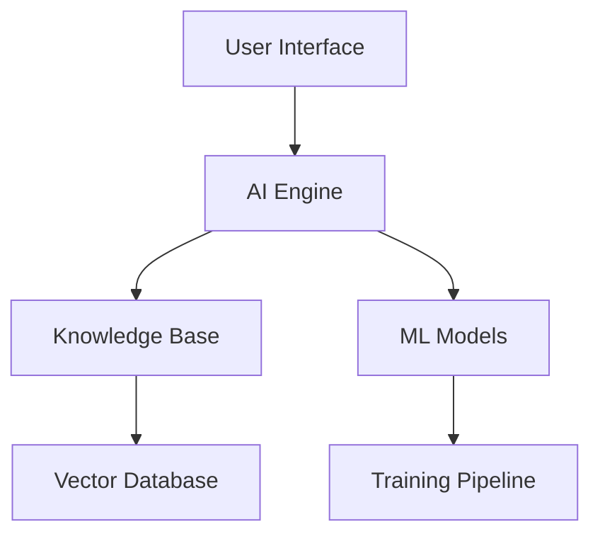

# Design Document

## Overview

This design outlines the comprehensive enhancement of the portfolio website into three main sections: Projects, Blog, and Info, built on Next.js 14 App Router with extensive shadcn/ui integration. The solution provides a unified MDX rendering system with Mermaid diagrams, PDF viewing, and video playback capabilities that work consistently across all sections, following modern web development best practices and accessibility standards.

## Architecture

### High-Level Architecture

```mermaid
graph TB
    Website[Portfolio Website - Next.js 14 App Router]
    
    Website --> Foundation[Foundation Layer]
    Foundation --> MDXRenderer[MDX Renderer - next-mdx-remote/rsc]
    Foundation --> ShadcnUI[shadcn/ui Components]
    Foundation --> TailwindCSS[Tailwind CSS]
    
    MDXRenderer --> MermaidRenderer[Mermaid Renderer - Client Component]
    MDXRenderer --> PdfViewer[PDF Viewer - Custom Component]
    MDXRenderer --> VideoPlayer[Video Player - vidstack]
    MDXRenderer --> SyntaxHighlighter[Syntax Highlighter]
    
    Website --> AppSections[Application Sections]
    AppSections --> ProjectsSection[Projects Section]
    AppSections --> BlogSection[Blog Section]
    AppSections --> InfoSection[Info Section]
    
    ProjectsSection --> ExistingProjects[Existing Hardcoded Projects]
    ProjectsSection --> FileBasedProjects[File-based Projects /projects]
    ProjectsSection --> ProjectDetailPages[Project Detail Pages]
    
    BlogSection --> NotionCMS[Notion CMS Integration]
    BlogSection --> BlogPosts[Blog Posts with MDX]
    BlogSection --> BlogManagement[Enhanced Error Handling]
    
    InfoSection --> PersonalInfo[Expanded Personal Info]
    InfoSection --> Experience[Experience & Education]
    InfoSection --> Skills[Skills & Achievements]
```



### Next.js 14 App Router Architecture

Optimized file structure following dual-pipeline architecture:

```
src/
├── app/
│   ├── (main)/                    # Route group for main layout
│   │   ├── layout.tsx            # Main layout with header/footer
│   │   ├── page.tsx              # Homepage with hero + featured content
│   │   ├── projects/
│   │   │   ├── page.tsx          # Projects listing page
│   │   │   ├── [slug]/
│   │   │   │   └── page.tsx      # Dynamic project pages (@next/mdx)
│   │   │   └── loading.tsx       # Loading UI
│   │   ├── blog/
│   │   │   ├── page.tsx          # Blog listing page
│   │   │   ├── [slug]/
│   │   │   │   └── page.tsx      # Dynamic blog pages (next-mdx-remote)
│   │   │   ├── loading.tsx       # Loading UI
│   │   │   └── error.tsx         # Error boundary
│   │   └── info/
│   │       └── page.tsx          # Info page (@next/mdx)
│   ├── layout.tsx                # Root layout
│   ├── globals.css               # Global styles + typography
│   └── api/
│       ├── revalidate/
│       │   └── route.ts          # Cache revalidation
│       └── notion/
│           └── webhook/
│               └── route.ts      # Notion webhook handler
├── components/
│   ├── ui/                       # shadcn/ui components
│   ├── layout/
│   │   ├── header.tsx           # Responsive header with NavigationMenu
│   │   ├── mobile-nav.tsx       # Sheet-based mobile navigation
│   │   ├── footer.tsx           # Footer with social links
│   │   └── theme-toggle.tsx     # Dark/light mode toggle
│   ├── mdx/
│   │   ├── mermaid.tsx          # Client-side Mermaid renderer
│   │   ├── pdf-viewer.tsx       # react-pdf integration
│   │   ├── code-block.tsx       # Syntax highlighting
│   │   └── table-of-contents.tsx # Floating TOC for long content
│   ├── projects/
│   │   ├── project-card.tsx     # Card component for project previews
│   │   ├── project-grid.tsx     # Grid layout with filtering
│   │   └── featured-projects.tsx # Homepage featured section
│   └── blog/
│       ├── blog-card.tsx        # Card component for blog previews
│       ├── blog-grid.tsx        # Grid layout
│       └── latest-posts.tsx     # Homepage latest posts section
├── content/
│   ├── projects/                # Local MDX files for projects
│   │   ├── find-and-fund.mdx
│   │   ├── obvius.mdx
│   │   └── assets/              # Project-specific assets
│   │       ├── find-and-fund/
│   │       └── obvius/
│   └── info/
│       └── about.mdx            # Info page content
├── lib/
│   ├── mdx.ts                   # @next/mdx utilities
│   ├── notion.ts                # Notion API client with caching
│   ├── types.ts                 # TypeScript interfaces with Zod
│   ├── utils.ts                 # Utility functions
│   └── cache.ts                 # Multi-layer caching utilities
└── styles/
    └── globals.css              # Tailwind + typography plugin
```

### System Components

The enhanced portfolio follows a hierarchical architecture with modern web standards:

1. **Foundation Layer**: 
   - **Next.js 14 App Router**: Server-side rendering, static generation, and optimal performance
   - **shadcn/ui**: Comprehensive component library for consistent UI/UX
   - **Tailwind CSS**: Utility-first styling with design system integration
   - **TypeScript**: Type safety across the entire application

2. **Content Rendering Layer**:
   - **MDX Renderer**: Universal content processing using next-mdx-remote/rsc
   - **Mermaid Integration**: Client-side diagram rendering with lazy loading
   - **Media Components**: PDF viewer and video player with accessibility support
   - **Syntax Highlighting**: Code block rendering with copy functionality

3. **Application Sections**:
   - **Projects Section**: Hybrid system combining existing and file-based projects
   - **Blog Section**: Notion CMS integration with enhanced error handling
   - **Info Section**: Structured personal information with rich content support

## Design Rationales & Technology Alignment

### Technology Stack Alignment
This design fully aligns with the established technology stack requirements:

- **Next.js 14+ with App Router**: Leveraged for optimal performance with server components and streaming
- **shadcn/ui Components**: Extensively used throughout for consistent, accessible UI components
- **Tailwind CSS**: Utility-first approach with HSL color system for theming
- **TypeScript**: Comprehensive type safety across all interfaces and components
- **Zod Validation**: Runtime type checking for frontmatter and API responses

### Key Design Decisions

#### Dual-Pipeline MDX Architecture
**Decision**: Implement separate pipelines for local (@next/mdx) and remote (next-mdx-remote) content
**Rationale**: 
- Local pipeline enables React component imports and build-time optimization for projects
- Remote pipeline provides flexibility for Notion CMS integration without build dependencies
- Maintains consistency in rendering while optimizing for different content sources

#### Client-Side Mermaid Rendering
**Decision**: Render Mermaid diagrams on the client with lazy loading
**Rationale**:
- Enables interactive features (zoom, pan) required by acceptance criteria
- Reduces server-side complexity and build times
- Provides better error handling and fallback mechanisms
- Supports dynamic theming based on user preferences

#### Project Status Highlighting Strategy
**Decision**: Implement priority-based highlighting for "currently-building" projects
**Rationale**:
- Addresses specific requirement for prominent display of active projects
- Uses visual hierarchy to guide visitor attention to current work
- Maintains professional appearance while emphasizing ongoing development

## Research Analysis & Best Practices

### 1. Next.js 14 App Router Architecture Analysis

**Scalable File Structure:**
- **Route Segments**: Using folder-based routing with `page.tsx`, `layout.tsx`, `loading.tsx`, `error.tsx`
- **Server Components by Default**: Leveraging RSC for optimal performance
- **Client Components**: Strategic use with `"use client"` directive for interactivity
- **Shared Types**: Centralized in `lib/types.ts` for consistency across the application

**Server-to-Browser Data Flow:**
1. **Static Generation**: Projects and blog posts pre-rendered at build time
2. **Server Components**: Data fetching happens on the server
3. **Streaming**: Progressive loading with Suspense boundaries
4. **Client Hydration**: Minimal JavaScript for interactive components

### 2. User Experience Strategy

**Primary User Journeys:**
1. **Portfolio Exploration**: Homepage → Projects → Project Details
2. **Content Consumption**: Blog → Article Reading → Related Content
3. **Professional Discovery**: Info Section → Experience → Contact

**shadcn/ui Component Integration:**
- **Navigation**: `NavigationMenu` for main navigation, `Breadcrumb` for context
- **Content Display**: `Card`, `Badge`, `Separator` for structured layouts
- **Interactive Elements**: `Button`, `Dialog`, `Sheet` for actions
- **Data Presentation**: `Table`, `Tabs`, `Accordion` for organized information
- **Feedback**: `Alert`, `Skeleton`, `Progress` for user feedback

**Micro-interactions & Loading Patterns:**
- **Skeleton Loading**: Using `Skeleton` component during data fetching
- **Progressive Enhancement**: Content loads progressively with `Suspense`
- **Smooth Transitions**: CSS transitions with Tailwind utilities
- **Hover States**: Interactive feedback on all clickable elements

### 3. Dual-Pipeline MDX Rendering System

**Hybrid Architecture Decision:**

| Content Type | Pipeline | Package | Use Case |
|-------------|----------|---------|----------|
| **Projects & Info** | Local | @next/mdx | Version-controlled content with React imports |
| **Blog** | Remote | next-mdx-remote | Notion CMS with decoupled publishing |

**Local Pipeline (@next/mdx):**
- **Content Location**: `src/content/projects/` and `src/content/info/`
- **Benefits**: Import statements, build-time optimization, Git version control
- **Perfect for**: Interactive demos, data visualizations, complex React components

**Remote Pipeline (next-mdx-remote):**
- **Content Source**: Notion API via headless CMS
- **Benefits**: Decoupled publishing, non-technical content editing
- **Perfect for**: Blog posts, articles, frequently updated content

**Custom Component Integration:**
```typescript
// MDX Custom Components
const mdxComponents = {
  // Enhanced code blocks with syntax highlighting
  code: CodeBlock,
  // Custom link component with PDF detection
  a: CustomLink,
  // Image optimization with Next.js Image
  img: OptimizedImage,
  // Mermaid diagram rendering
  pre: MermaidPre,
  // Video player integration
  video: VideoPlayer,
  // Interactive tables
  table: DataTable,
}
```

**Mermaid.js Integration Strategy:**
- **Server-side vs Client-side**: Client-side rendering for interactivity and zoom/pan functionality
- **Lazy Loading**: Dynamic import to reduce initial bundle size
- **Interactive Features**: Zoom and pan controls for complex diagrams with responsive touch support
- **Error Handling**: Graceful fallback to code block on render failure with clear error messaging
- **Accessibility**: Alt text, keyboard navigation support, and screen reader compatibility
- **Performance**: Viewport-based rendering for large diagrams to maintain smooth interactions

### 4. Rich Media Integration

**Custom Link Component for PDF Detection:**
```typescript
const CustomLink = ({ href, children, ...props }) => {
  if (href?.endsWith('.pdf')) {
    return (
      <PDFViewer 
        src={href} 
        title={children} 
        viewMode="inline"
        downloadable={true}
        showToolbar={true}
        fallbackText="PDF viewing not supported. Click to download."
      />
    )
  }
  return <Link href={href} {...props}>{children}</Link>
}
```

**Design Rationale**: The PDF viewer provides both inline viewing for immediate access and download options for offline use, addressing the requirement for flexible PDF handling in project documentation.

**vidstack Integration:**
- **Modern Video Player**: Feature-rich with accessibility support
- **Responsive Design**: Adapts to container size
- **Performance**: Lazy loading and optimized delivery
- **Customization**: Themed to match site design

**Data Services Architecture:**

**Local Markdown Files Service:**
```typescript
interface ProjectService {
  getProjects(): Promise<Project[]>
  getProject(slug: string): Promise<Project>
  getProjectsByCategory(category: string): Promise<Project[]>
}
```

**Notion API Service:**
```typescript
interface BlogService {
  getPosts(): Promise<BlogPost[]>
  getPost(slug: string): Promise<BlogPost>
  validateConnection(): Promise<boolean>
}
```

**Caching Strategies in Next.js 14:**
- **Static Generation**: Build-time caching for projects
- **Incremental Static Regeneration**: Time-based revalidation for blog posts
- **React Cache**: Request-level caching for data fetching
- **Unstable_cache**: Long-term caching for expensive operations

## Data Models & Type Safety

### TypeScript Interfaces with Zod Validation

```typescript
import { z } from 'zod';

// Local MDX files in /content/projects
export const ProjectSchema = z.object({
  slug: z.string(),
  title: z.string(),
  publishedAt: z.string(),
  summary: z.string(),
  image: z.string(),
  tags: z.array(z.string()),
  url: z.string().optional(),
  repository: z.string().optional(),
  content: z.any(), // Compiled MDX content
});

export type Project = z.infer<typeof ProjectSchema>;

// Blog posts fetched from Notion
export const BlogPostSchema = z.object({
  id: z.string(),
  slug: z.string(),
  title: z.string(),
  publishedAt: z.string(),
  summary: z.string(),
  tags: z.array(z.string()),
  rawContent: z.string(), // Raw MDX string from Notion
});

export type BlogPost = z.infer<typeof BlogPostSchema>;

// Static "Info" page
export const InfoPageSchema = z.object({
  title: z.string(),
  content: z.any(), // Compiled MDX content
});

export type InfoPage = z.infer<typeof InfoPageSchema>;
```

## Layout Architecture

### Main Layout Structure

#### Root Layout (`src/app/layout.tsx`)
```typescript
export default function RootLayout({
  children,
}: {
  children: React.ReactNode;
}) {
  return (
    <html lang="en" suppressHydrationWarning>
      <body className={cn("min-h-screen bg-background font-sans antialiased", fontSans.variable)}>
        <ThemeProvider
          attribute="class"
          defaultTheme="system"
          enableSystem
          disableTransitionOnChange
        >
          <div className="relative flex min-h-screen flex-col">
            {children}
          </div>
          <Toaster />
        </ThemeProvider>
      </body>
    </html>
  );
}
```

#### Main Layout (`src/app/(main)/layout.tsx`)
```typescript
export default function MainLayout({
  children,
}: {
  children: React.ReactNode;
}) {
  return (
    <>
      <Header />
      <main className="flex-1">{children}</main>
      <Footer />
    </>
  );
}
```

### Page-Specific Layouts

#### Homepage Layout (`src/app/(main)/page.tsx`)
```typescript
export default function HomePage() {
  return (
    <div className="container mx-auto px-4 py-8">
      {/* Hero Section */}
      <section className="text-center py-20">
        <h1 className="text-4xl font-bold tracking-tight lg:text-6xl">
          Building the Future with Code
        </h1>
        <p className="mt-6 text-lg leading-8 text-muted-foreground max-w-2xl mx-auto">
          Full-stack developer passionate about AI, machine learning, and creating 
          impactful digital experiences.
        </p>
      </section>

      {/* Featured Projects */}
      <section className="py-16">
        <h2 className="text-3xl font-bold mb-8">Featured Projects</h2>
        <FeaturedProjects />
      </section>

      {/* Latest Blog Posts */}
      <section className="py-16">
        <h2 className="text-3xl font-bold mb-8">Latest Posts</h2>
        <LatestPosts />
      </section>
    </div>
  );
}
```

#### List Pages Layout
```typescript
// Projects listing with sidebar filtering
export default function ProjectsPage() {
  return (
    <div className="container mx-auto px-4 py-8">
      <div className="flex flex-col lg:flex-row gap-8">
        {/* Sidebar for filtering */}
        <aside className="lg:w-64">
          <Card className="p-6">
            <h3 className="font-semibold mb-4">Filter Projects</h3>
            <div className="space-y-4">
              <div>
                <Label>Tags</Label>
                <div className="flex flex-wrap gap-2 mt-2">
                  {tags.map((tag) => (
                    <Button
                      key={tag}
                      variant={selectedTags.includes(tag) ? "default" : "outline"}
                      size="sm"
                      onClick={() => toggleTag(tag)}
                    >
                      {tag}
                    </Button>
                  ))}
                </div>
              </div>
            </div>
          </Card>
        </aside>

        {/* Main content area */}
        <main className="flex-1">
          <ProjectGrid projects={filteredProjects} />
        </main>
      </div>
    </div>
  );
}
```

#### Content Pages Layout
```typescript
// Single project/blog post with TOC
export default function ContentPage({ content, toc }) {
  return (
    <div className="container mx-auto px-4 py-8">
      <div className="flex flex-col lg:flex-row gap-8">
        {/* Main content */}
        <article className="flex-1 max-w-none">
          <div className="prose prose-slate dark:prose-invert lg:prose-lg">
            {content}
          </div>
        </article>

        {/* Table of Contents - Desktop only */}
        <aside className="hidden lg:block lg:w-64">
          <div className="sticky top-8">
            <TableOfContents headings={toc} />
          </div>
        </aside>
      </div>
    </div>
  );
}
```

## Components and Interfaces

### 1. Projects Section

#### Combined Project System
The Projects section merges existing hardcoded projects with new file-based projects:

**Existing Projects**: Continue to display current hardcoded projects from `app/page.tsx`
**New Projects**: Load additional projects from `/projects` directory

**Project Status Highlighting**: Projects marked as "currently-building" receive prominent visual treatment with:
- Distinctive badge styling using shadcn/ui Badge component with "secondary" variant
- Priority positioning in project listings
- Enhanced card styling with subtle animations and border emphasis
- Special "Work in Progress" indicators and progress visualization where applicable

#### Project File Structure
```
projects/
├── advanced-project-1.md
├── research-project-2.md
├── tutorial-series-3.md
└── assets/
    ├── advanced-project-1/
    │   ├── demo.mp4
    │   ├── architecture.mermaid
    │   ├── documentation.pdf
    │   └── screenshots/
    ├── research-project-2/
    └── ...
```

#### Project Markdown Format
```markdown
---
title: "Advanced AI Research Tool"
subtitle: "Next-generation research assistant with ML capabilities"
date: "2024-12-01"
status: "currently-building" | "completed" | "research"
tags: ["AI", "ML", "Research", "Python"]
github: "https://github.com/username/project"
live: "https://project-demo.com"
image: "./assets/advanced-project-1/hero.jpg"
video: "./assets/advanced-project-1/demo.mp4"
pinned: false
category: "research"
---

# Project Overview

Detailed project description with **rich markdown formatting**.

## System Architecture



## Technical Implementation

```python
class ResearchAssistant:
    def __init__(self):
        self.model = load_model()
    
    def analyze_document(self, doc):
        return self.model.process(doc)
```

## Documentation

[Technical Specification](./assets/advanced-project-1/tech-spec.pdf)

## Demo Video


```

#### Project Service Interface
```typescript
interface Project {
  id: string;
  title: string;
  subtitle: string;
  description: string;
  content: string;
  date: string;
  status: 'currently-building' | 'completed' | 'research';
  tags: string[];
  github?: string;
  live?: string;
  image?: string;
  video?: string;
  pinned?: boolean;
  slug: string;
  source: 'hardcoded' | 'file-based';
  priority?: number; // For highlighting "currently-building" projects
}

interface ProjectService {
  getAllProjects(): Promise<Project[]>; // Combines both sources
  getProject(slug: string): Promise<Project>;
  getHardcodedProjects(): Promise<Project[]>;
  getFileBasedProjects(): Promise<Project[]>;
  getProjectsByStatus(status: string): Promise<Project[]>;
  getProjectsByTag(tag: string): Promise<Project[]>;
}
```

### 2. Blog Section

#### Notion CMS Integration
Enhanced blog system with improved error handling and management capabilities.

#### Blog Service Interface
```typescript
interface BlogPost {
  id: string;
  title: string;
  description: string;
  content: string;
  date: string;
  slug: string;
  author: string;
  published: boolean;
}

interface BlogService {
  getBlogPosts(): Promise<BlogPost[]>;
  getBlogPost(slug: string): Promise<BlogPost>;
  validateNotionConnection(): Promise<boolean>;
  getConnectionStatus(): Promise<ConnectionStatus>;
  refreshCache(): Promise<void>;
}

interface ConnectionStatus {
  connected: boolean;
  error?: string;
  lastSync?: string;
  postsCount?: number;
}
```

### 3. Info Section

#### Expanded Personal Information
Enhanced version of the current personal info with structured content support.

#### Info Content Structure
```typescript
interface PersonalInfo {
  profile: {
    name: string;
    location: string;
    bio: string;
    profileImage: string;
    socialLinks: SocialLink[];
  };
  achievements: Achievement[];
  experience: Experience[];
  education: Education[];
  skills: SkillCategory[];
}

interface Achievement {
  title: string;
  description: string;
  date?: string;
  link?: string;
  type: 'award' | 'recognition' | 'milestone';
}

interface Experience {
  title: string;
  company: string;
  duration: string;
  description: string[];
  skills?: string[];
}
```

### 4. Universal MDX Rendering System

#### Core MDX Renderer Architecture
```typescript
// Universal MDX Renderer using next-mdx-remote/rsc
interface MDXRendererProps {
  source: string;
  components?: Record<string, React.ComponentType>;
  options?: {
    parseFrontmatter?: boolean;
    scope?: Record<string, any>;
  };
}

// Mermaid Renderer - Client Component with Lazy Loading
interface MermaidRendererProps {
  code: string;
  className?: string;
  theme?: 'default' | 'dark' | 'forest' | 'neutral';
  zoomable?: boolean; // Enable zoom and pan for complex diagrams
  pannable?: boolean; // Enable pan functionality
  maxZoom?: number; // Maximum zoom level
  minZoom?: number; // Minimum zoom level
}

// PDF Viewer Component with Inline Viewing and Download Options
interface PDFViewerProps {
  src: string;
  title?: string;
  width?: string | number;
  height?: string | number;
  embedded?: boolean; // Inline PDF viewing within the page
  downloadable?: boolean; // Show download button
  viewMode?: 'inline' | 'modal' | 'external'; // Different viewing modes
  showToolbar?: boolean; // PDF navigation controls
  initialPage?: number; // Starting page for multi-page PDFs
  fallbackText?: string; // Text shown when PDF can't be displayed
}

// Video Player using vidstack
interface VideoPlayerProps {
  src: string;
  poster?: string;
  title?: string;
  aspectRatio?: string;
  autoplay?: boolean;
  muted?: boolean;
  controls?: boolean;
}
```

#### shadcn/ui Enhanced Components
```typescript
// Enhanced Code Block with shadcn/ui styling
interface CodeBlockProps {
  children: string;
  className?: string;
  language?: string;
  showLineNumbers?: boolean;
  highlightLines?: number[];
  filename?: string;
}

// Custom Link Component with shadcn/ui Button variants
interface CustomLinkProps {
  href: string;
  children: React.ReactNode;
  variant?: 'default' | 'outline' | 'ghost';
  external?: boolean;
  download?: boolean;
}

// Data Table using shadcn/ui Table components
interface DataTableProps {
  data: any[];
  columns: ColumnDef<any>[];
  searchable?: boolean;
  sortable?: boolean;
  pagination?: boolean;
}

// Image Gallery with shadcn/ui Dialog
interface ImageGalleryProps {
  images: {
    src: string;
    alt: string;
    caption?: string;
  }[];
  columns?: number;
  aspectRatio?: string;
}
```

#### Custom MDX Components Integration
```typescript
const mdxComponents = {
  // Typography with shadcn/ui styling
  h1: ({ children, ...props }) => (
    <h1 className="scroll-m-20 text-4xl font-extrabold tracking-tight lg:text-5xl" {...props}>
      {children}
    </h1>
  ),
  h2: ({ children, ...props }) => (
    <h2 className="scroll-m-20 border-b pb-2 text-3xl font-semibold tracking-tight first:mt-0" {...props}>
      {children}
    </h2>
  ),
  
  // Enhanced code blocks
  code: CodeBlock,
  pre: MermaidPre, // Detects mermaid and renders accordingly
  
  // Custom link handling
  a: CustomLink, // Detects PDFs, external links, etc.
  
  // Media components
  img: OptimizedImage,
  video: VideoPlayer,
  
  // Data presentation
  table: DataTable,
  
  // Interactive elements
  blockquote: ({ children, ...props }) => (
    <blockquote className="mt-6 border-l-2 pl-6 italic" {...props}>
      {children}
    </blockquote>
  ),
  
  // Custom components for rich content
  Alert: ({ children, variant = "default", ...props }) => (
    <Alert variant={variant} {...props}>
      {children}
    </Alert>
  ),
  
  Tabs: ({ children, ...props }) => (
    <Tabs {...props}>
      {children}
    </Tabs>
  ),
  
  Card: ({ children, ...props }) => (
    <Card {...props}>
      {children}
    </Card>
  ),
}

## Data Models

### Project Model
```typescript
interface ProjectFrontmatter {
  title: string;
  subtitle?: string;
  date: string;
  status: 'currently-building' | 'completed' | 'research';
  tags: string[];
  github?: string;
  live?: string;
  image?: string;
  video?: string;
  pinned?: boolean;
  category?: string;
}

interface ProjectContent {
  frontmatter: ProjectFrontmatter;
  content: string;
  slug: string;
  readingTime: number;
  wordCount: number;
}
```

### Media Asset Model
```typescript
interface MediaAsset {
  path: string;
  type: 'image' | 'video' | 'pdf' | 'document';
  size: number;
  dimensions?: { width: number; height: number };
  optimized?: boolean;
}
```

### Interactive Markdown Elements

The design supports advanced interactive elements within markdown content to create rich, engaging project documentation:

#### Collapsible Sections
```typescript
interface CollapsibleSectionProps {
  title: string;
  defaultOpen?: boolean;
  children: React.ReactNode;
}
```
- **Implementation**: Using shadcn/ui Collapsible component
- **Use Case**: Long technical documentation, FAQ sections, detailed specifications
- **Accessibility**: Keyboard navigation and screen reader support

#### Tabbed Content
```typescript
interface TabbedContentProps {
  tabs: Array<{
    label: string;
    content: React.ReactNode;
    disabled?: boolean;
  }>;
  defaultTab?: string;
}
```
- **Implementation**: Using shadcn/ui Tabs component
- **Use Case**: Code examples in multiple languages, different implementation approaches
- **Features**: Persistent tab state, responsive design for mobile

#### Interactive Code Blocks
```typescript
interface InteractiveCodeBlockProps {
  code: string;
  language: string;
  editable?: boolean;
  runnable?: boolean;
  copyable?: boolean;
  highlightLines?: number[];
}
```
- **Features**: Copy to clipboard, line highlighting, syntax highlighting
- **Integration**: Works seamlessly with existing code block rendering
- **Design Rationale**: Enhances developer experience when viewing technical documentation

## Error Handling

### Project System Error Handling
- **File Not Found**: Graceful fallback with error message
- **Invalid Frontmatter**: Validation with helpful error messages
- **Markdown Parsing Errors**: Fallback to raw content display
- **Asset Loading Failures**: Placeholder images and retry mechanisms

### Mermaid Rendering Error Handling
- **Invalid Syntax**: Display error message with raw code
- **Rendering Timeout**: Fallback to code block display
- **Browser Compatibility**: Progressive enhancement approach

### Blog System Error Handling
- **Notion API Failures**: Cached content fallback
- **Network Issues**: Retry logic with exponential backoff
- **Authentication Errors**: Clear error messages and setup guidance
- **Rate Limiting**: Queue management and user feedback

## Testing Strategy

### Unit Testing
- **Project Parser**: Test frontmatter parsing and validation
- **Markdown Renderer**: Test component rendering and plugin integration
- **Mermaid Renderer**: Test diagram generation and error handling
- **Blog Service**: Test API integration and error scenarios

### Integration Testing
- **File System Integration**: Test project loading from filesystem
- **Notion API Integration**: Test blog post fetching and parsing
- **Media Asset Loading**: Test asset resolution and optimization
- **Route Generation**: Test dynamic route creation for projects

### End-to-End Testing
- **Project Navigation**: Test browsing between projects
- **Content Rendering**: Test markdown and Mermaid rendering
- **Blog Functionality**: Test blog post listing and detail views
- **Responsive Design**: Test across different screen sizes

### Performance Testing
- **Large Project Loading**: Test with projects containing many assets
- **Mermaid Rendering**: Test complex diagram rendering performance
- **Image Optimization**: Test asset loading and caching
- **Bundle Size**: Monitor JavaScript bundle size impact

## Project Management & Quality Assurance Plan

### Development Roadmap (Granular Phases)

#### Phase 1: Foundation & Infrastructure (Week 1-2)
**1.1 Next.js 14 App Router Setup**
- [ ] 1.1.1 Update Next.js to latest version and configure App Router
- [ ] 1.1.2 Set up TypeScript configuration with strict mode
- [ ] 1.1.3 Configure Tailwind CSS with design system tokens
- [ ] 1.1.4 Install and configure shadcn/ui components

**1.2 MDX Rendering System**
- [ ] 1.2.1 Install and configure next-mdx-remote/rsc
- [ ] 1.2.2 Create universal MDX renderer component
- [ ] 1.2.3 Implement custom MDX components with shadcn/ui
- [ ] 1.2.4 Set up syntax highlighting with Prism/Shiki

**1.3 Core Components**
- [ ] 1.3.1 Create Mermaid renderer with lazy loading
- [ ] 1.3.2 Implement PDF viewer component
- [ ] 1.3.3 Integrate vidstack video player
- [ ] 1.3.4 Build responsive image gallery component

#### Phase 2: Projects Section (Week 3-4)
**2.1 File-based Project System**
- [ ] 2.1.1 Create project file structure and parsing utilities
- [ ] 2.1.2 Implement project metadata extraction from frontmatter
- [ ] 2.1.3 Build project listing with shadcn/ui cards
- [ ] 2.1.4 Create dynamic project detail pages

**2.2 Project Enhancement Features**
- [ ] 2.2.1 Merge existing hardcoded projects with file-based system
- [ ] 2.2.2 Implement project filtering and search with Command component
- [ ] 2.2.3 Add project categorization with Badge components
- [ ] 2.2.4 Create project asset management system

#### Phase 3: Blog Section Enhancement (Week 5-6)
**3.1 Notion Integration Fixes**
- [ ] 3.1.1 Debug current Notion API connection issues
- [ ] 3.1.2 Implement robust error handling and retry logic
- [ ] 3.1.3 Add connection status monitoring with Alert components
- [ ] 3.1.4 Create fallback mechanisms for offline scenarios

**3.2 Blog Content Rendering**
- [ ] 3.2.1 Integrate blog posts with MDX rendering system
- [ ] 3.2.2 Implement blog post listing with shadcn/ui components
- [ ] 3.2.3 Add blog search and filtering capabilities
- [ ] 3.2.4 Create blog post sharing and navigation features

#### Phase 4: Info Section & Polish (Week 7-8)
**4.1 Info Section Expansion**
- [ ] 4.1.1 Restructure personal info with Tabs and Accordion components
- [ ] 4.1.2 Add timeline component for experience and education
- [ ] 4.1.3 Implement skills visualization with Progress components
- [ ] 4.1.4 Create interactive contact form with Form components

**4.2 Performance & Accessibility**
- [ ] 4.2.1 Implement performance optimizations (lazy loading, code splitting)
- [ ] 4.2.2 Add comprehensive accessibility features
- [ ] 4.2.3 Optimize SEO with Next.js metadata API
- [ ] 4.2.4 Implement comprehensive error boundaries

### Git Branching Strategy (Solo Developer)

**Main Branches:**
- `main`: Production-ready code
- `develop`: Integration branch for features

**Feature Branches:**
- `feature/mdx-renderer`: MDX rendering system
- `feature/projects-section`: Projects enhancement
- `feature/blog-fixes`: Blog system improvements
- `feature/info-section`: Info section expansion

**Workflow:**
1. Create feature branch from `develop`
2. Implement feature with regular commits
3. Self-review and test thoroughly
4. Merge to `develop` via pull request
5. Deploy to staging for testing
6. Merge `develop` to `main` for production

### Testing Strategy

#### Unit Tests (Jest + React Testing Library)
```typescript
// Example test structure
describe('MDXRenderer', () => {
  it('renders markdown content correctly', () => {
    // Test MDX rendering
  });
  
  it('handles Mermaid diagrams', () => {
    // Test Mermaid integration
  });
  
  it('processes custom components', () => {
    // Test custom component rendering
  });
});

describe('ProjectService', () => {
  it('loads projects from filesystem', () => {
    // Test project loading
  });
  
  it('parses frontmatter correctly', () => {
    // Test metadata extraction
  });
});
```

#### Integration Tests
- **API Integration**: Test Notion API connection and data fetching
- **File System**: Test project file loading and parsing
- **Component Integration**: Test MDX components working together
- **Navigation**: Test routing between sections

#### End-to-End Tests (Playwright)
```typescript
// Example E2E test
test('user can navigate through portfolio sections', async ({ page }) => {
  await page.goto('/');
  
  // Test navigation to projects
  await page.click('[data-testid="projects-link"]');
  await expect(page).toHaveURL('/projects');
  
  // Test project detail navigation
  await page.click('[data-testid="project-card"]:first-child');
  await expect(page.locator('h1')).toBeVisible();
  
  // Test Mermaid diagram rendering
  await expect(page.locator('.mermaid')).toBeVisible();
});
```

## Non-Functional Requirements

### Performance Optimizations

#### Next.js 14 Specific Optimizations
- **Server Components**: Maximize server-side rendering for content
- **Streaming**: Use Suspense boundaries for progressive loading
- **Static Generation**: Pre-render projects and blog posts at build time
- **Image Optimization**: Use Next.js Image component with proper sizing
- **Bundle Splitting**: Lazy load Mermaid and other heavy components

#### Code Splitting Strategy
```typescript
// Lazy load heavy components
const MermaidRenderer = dynamic(() => import('./mermaid-renderer'), {
  loading: () => <Skeleton className="h-64 w-full" />,
  ssr: false
});

const PDFViewer = dynamic(() => import('./pdf-viewer'), {
  loading: () => <Skeleton className="h-96 w-full" />
});
```

#### Caching Strategy
- **Static Assets**: Long-term caching with proper cache headers
- **API Responses**: Implement stale-while-revalidate for Notion data
- **Build Optimization**: Use Next.js build cache for faster builds

### Accessibility Guidelines

#### WCAG 2.1 AA Compliance
- **Keyboard Navigation**: All interactive elements accessible via keyboard
- **Screen Reader Support**: Proper ARIA labels and semantic HTML
- **Color Contrast**: Minimum 4.5:1 ratio for text
- **Focus Management**: Visible focus indicators and logical tab order

#### Custom Component Accessibility
```typescript
// Accessible Mermaid component
const MermaidRenderer = ({ code, title }) => {
  return (
    <div role="img" aria-label={title || "Diagram"}>
      <div className="sr-only">{title}</div>
      <div className="mermaid">{code}</div>
    </div>
  );
};

// Accessible PDF viewer
const PDFViewer = ({ src, title }) => {
  return (
    <div className="pdf-container">
      <iframe
        src={src}
        title={title}
        aria-label={`PDF document: ${title}`}
        className="w-full h-96"
      />
      <a href={src} download className="sr-only">
        Download {title}
      </a>
    </div>
  );
};
```

### Security Considerations

#### Content Security
- **MDX Sanitization**: Use rehype-sanitize for HTML content
- **XSS Prevention**: Sanitize all user-generated content
- **File Upload Validation**: Validate file types and sizes for assets
- **Path Traversal Protection**: Validate all file paths

#### rehype-sanitize Configuration
```typescript
import rehypeSanitize, { defaultSchema } from 'rehype-sanitize';

const sanitizeOptions = {
  ...defaultSchema,
  attributes: {
    ...defaultSchema.attributes,
    // Allow specific attributes for custom components
    div: [...(defaultSchema.attributes?.div || []), 'className', 'data-*'],
    span: [...(defaultSchema.attributes?.span || []), 'className'],
  },
  tagNames: [
    ...defaultSchema.tagNames,
    // Allow custom elements
    'mermaid-diagram',
    'pdf-viewer',
  ],
};
```

#### API Security
- **Environment Variables**: Secure storage of Notion API keys
- **Rate Limiting**: Implement client-side rate limiting for API calls
- **Error Handling**: Avoid exposing sensitive information in errors
- **CORS Configuration**: Proper CORS setup for API routes

### Monitoring & Analytics

#### Performance Monitoring
- **Core Web Vitals**: Track LCP, FID, CLS metrics
- **Bundle Analysis**: Monitor JavaScript bundle sizes
- **Loading Performance**: Track page load times and resource loading
- **Error Tracking**: Implement error boundary reporting

#### User Analytics
- **Page Views**: Track section and page popularity
- **User Engagement**: Monitor time spent on content
- **Search Queries**: Track what users search for
- **Device Usage**: Monitor mobile vs desktop usage patterns

#### Implementation Example
```typescript
// Performance monitoring
export function reportWebVitals(metric) {
  if (metric.label === 'web-vital') {
    // Send to analytics service
    analytics.track('Web Vital', {
      name: metric.name,
      value: metric.value,
      id: metric.id,
    });
  }
}

// Error boundary with reporting
export class ErrorBoundary extends Component {
  componentDidCatch(error, errorInfo) {
    // Report error to monitoring service
    errorReporting.captureException(error, {
      extra: errorInfo,
      tags: {
        component: 'MDXRenderer',
      },
    });
  }
}
```

## Security Considerations

### Content Security
- **Markdown Sanitization**: Use rehype-sanitize for HTML content
- **Asset Validation**: Validate file types and sizes
- **XSS Prevention**: Sanitize user-generated content
- **Path Traversal Protection**: Validate asset paths

### API Security
- **Notion Token Management**: Secure environment variable handling
- **Rate Limiting**: Implement client-side rate limiting
- **Error Information**: Avoid exposing sensitive information in errors

## Performance Optimizations

### Content Loading
- **Lazy Loading**: Load project content on demand
- **Image Optimization**: Use Next.js Image component with optimization
- **Code Splitting**: Split Mermaid renderer into separate bundle
- **Caching**: Implement browser and server-side caching

### Rendering Performance
- **Mermaid Optimization**: Render diagrams asynchronously
- **Syntax Highlighting**: Use lightweight syntax highlighter
- **Bundle Optimization**: Tree-shake unused dependencies
- **Progressive Enhancement**: Load advanced features progressively

## Accessibility

### Content Accessibility
- **Alt Text**: Ensure all images have descriptive alt text
- **Heading Structure**: Maintain proper heading hierarchy
- **Color Contrast**: Ensure sufficient color contrast ratios
- **Keyboard Navigation**: Support keyboard-only navigation

### Diagram Accessibility
- **Mermaid Alt Text**: Provide text descriptions for diagrams
- **Screen Reader Support**: Ensure diagrams are accessible to screen readers
- **High Contrast Mode**: Support high contrast display modes

## Monitoring and Analytics

### Error Monitoring
- **Client-Side Errors**: Track JavaScript errors and rendering failures
- **API Failures**: Monitor Notion API connection issues
- **Performance Metrics**: Track page load times and rendering performance

### Usage Analytics
- **Project Views**: Track which projects are most viewed
- **Content Engagement**: Monitor time spent on project pages
- **Search Queries**: Track what users are searching for
- **Device Usage**: Monitor mobile vs desktop usage patterns
### 1. H
eader Component with Responsive Navigation

```typescript
export function Header() {
  const [isOpen, setIsOpen] = useState(false);

  return (
    <header className="sticky top-0 z-50 w-full border-b bg-background/95 backdrop-blur supports-[backdrop-filter]:bg-background/60">
      <div className="container flex h-14 items-center">
        {/* Logo */}
        <Link href="/" className="mr-6 flex items-center space-x-2">
          <span className="font-bold">Portfolio</span>
        </Link>

        {/* Desktop Navigation */}
        <NavigationMenu className="hidden md:flex">
          <NavigationMenuList>
            <NavigationMenuItem>
              <NavigationMenuLink href="/projects">Projects</NavigationMenuLink>
            </NavigationMenuItem>
            <NavigationMenuItem>
              <NavigationMenuLink href="/blog">Blog</NavigationMenuLink>
            </NavigationMenuItem>
            <NavigationMenuItem>
              <NavigationMenuLink href="/info">Info</NavigationMenuLink>
            </NavigationMenuItem>
          </NavigationMenuList>
        </NavigationMenu>

        <div className="flex flex-1 items-center justify-end space-x-2">
          <ThemeToggle />
          
          {/* Mobile Navigation */}
          <Sheet open={isOpen} onOpenChange={setIsOpen}>
            <SheetTrigger asChild className="md:hidden">
              <Button variant="ghost" size="icon">
                <Menu className="h-5 w-5" />
              </Button>
            </SheetTrigger>
            <SheetContent side="right">
              <MobileNav onClose={() => setIsOpen(false)} />
            </SheetContent>
          </Sheet>
        </div>
      </div>
    </header>
  );
}
```

### 2. Client-Side Mermaid Renderer

```typescript
'use client';

import { useEffect, useRef, useState } from 'react';
import { Skeleton } from '@/components/ui/skeleton';
import { Alert, AlertDescription } from '@/components/ui/alert';

interface MermaidProps {
  code: string;
  className?: string;
}

export function Mermaid({ code, className }: MermaidProps) {
  const ref = useRef<HTMLDivElement>(null);
  const [isLoading, setIsLoading] = useState(true);
  const [error, setError] = useState<string | null>(null);

  useEffect(() => {
    const renderDiagram = async () => {
      try {
        // Lazy load Mermaid only when needed
        const mermaid = (await import('mermaid')).default;
        
        mermaid.initialize({
          startOnLoad: false,
          theme: 'default',
          securityLevel: 'loose',
        });

        if (ref.current) {
          const { svg } = await mermaid.render('mermaid-' + Math.random(), code);
          ref.current.innerHTML = svg;
        }
        
        setIsLoading(false);
      } catch (err) {
        setError(err instanceof Error ? err.message : 'Failed to render diagram');
        setIsLoading(false);
      }
    };

    renderDiagram();
  }, [code]);

  if (isLoading) {
    return <Skeleton className="h-64 w-full" />;
  }

  if (error) {
    return (
      <Alert variant="destructive">
        <AlertDescription>
          Failed to render diagram: {error}
          <details className="mt-2">
            <summary className="cursor-pointer">Show code</summary>
            <pre className="mt-2 text-xs overflow-auto">{code}</pre>
          </details>
        </AlertDescription>
      </Alert>
    );
  }

  return (
    <div 
      ref={ref} 
      className={cn("mermaid-container", className)}
      role="img"
      aria-label="Diagram"
    />
  );
}
```

### 3. PDF Viewer Component

```typescript
'use client';

import { useState } from 'react';
import { Document, Page, pdfjs } from 'react-pdf';
import { Button } from '@/components/ui/button';
import { Card } from '@/components/ui/card';
import { ChevronLeft, ChevronRight, Download } from 'lucide-react';

// Configure PDF.js worker
pdfjs.GlobalWorkerOptions.workerSrc = `//cdnjs.cloudflare.com/ajax/libs/pdf.js/${pdfjs.version}/pdf.worker.min.js`;

interface PDFViewerProps {
  src: string;
  title?: string;
  className?: string;
}

export function PDFViewer({ src, title, className }: PDFViewerProps) {
  const [numPages, setNumPages] = useState<number>(0);
  const [pageNumber, setPageNumber] = useState<number>(1);
  const [loading, setLoading] = useState(true);

  function onDocumentLoadSuccess({ numPages }: { numPages: number }) {
    setNumPages(numPages);
    setLoading(false);
  }

  return (
    <Card className={cn("p-4", className)}>
      <div className="flex items-center justify-between mb-4">
        <h3 className="font-semibold">{title || 'PDF Document'}</h3>
        <Button variant="outline" size="sm" asChild>
          <a href={src} download>
            <Download className="h-4 w-4 mr-2" />
            Download
          </a>
        </Button>
      </div>

      <div className="border rounded-lg overflow-hidden">
        <Document
          file={src}
          onLoadSuccess={onDocumentLoadSuccess}
          loading={<Skeleton className="h-96 w-full" />}
        >
          <Page 
            pageNumber={pageNumber} 
            renderTextLayer={true}
            renderAnnotationLayer={true}
            className="max-w-full"
          />
        </Document>
      </div>

      {numPages > 1 && (
        <div className="flex items-center justify-between mt-4">
          <Button
            variant="outline"
            size="sm"
            onClick={() => setPageNumber(Math.max(1, pageNumber - 1))}
            disabled={pageNumber <= 1}
          >
            <ChevronLeft className="h-4 w-4" />
            Previous
          </Button>
          
          <span className="text-sm text-muted-foreground">
            Page {pageNumber} of {numPages}
          </span>
          
          <Button
            variant="outline"
            size="sm"
            onClick={() => setPageNumber(Math.min(numPages, pageNumber + 1))}
            disabled={pageNumber >= numPages}
          >
            Next
            <ChevronRight className="h-4 w-4" />
          </Button>
        </div>
      )}
    </Card>
  );
}
```

## Notion Integration Architecture

### Multi-Layer Caching Strategy

```typescript
// src/lib/cache.ts
import { unstable_cache } from 'next/cache';
import { cache } from 'react';

// Layer 1: Request Memoization (In-Memory)
export const memoizedNotionCall = cache(async (pageId: string) => {
  // This prevents duplicate API calls within a single render
  return await notion.pages.retrieve({ page_id: pageId });
});

// Layer 2: Data Cache (Persistent)
export const cachedNotionCall = unstable_cache(
  async (pageId: string) => {
    return await memoizedNotionCall(pageId);
  },
  ['notion-page'], // Cache key
  {
    revalidate: 3600, // 1 hour
    tags: ['notion'], // For tag-based revalidation
  }
);

// Layer 3: CDN/Edge Cache (via fetch)
export const edgeCachedNotionCall = async (url: string) => {
  return await fetch(url, {
    next: { 
      revalidate: 86400, // 24 hours
      tags: ['notion-content'] 
    }
  });
};
```

### Notion API Client

```typescript
// src/lib/notion.ts
import { Client } from '@notionhq/client';
import { NotionToMarkdown } from 'notion-to-md';
import { BlogPostSchema } from './types';

const notion = new Client({
  auth: process.env.NOTION_TOKEN,
});

const n2m = new NotionToMarkdown({ notionClient: notion });

export class NotionService {
  private static instance: NotionService;
  
  static getInstance(): NotionService {
    if (!NotionService.instance) {
      NotionService.instance = new NotionService();
    }
    return NotionService.instance;
  }

  async getAllPosts(): Promise<BlogPost[]> {
    try {
      const response = await cachedNotionCall(
        'getAllPosts',
        async () => {
          const database = await notion.databases.query({
            database_id: process.env.NOTION_DATABASE_ID!,
            filter: {
              property: 'Published',
              checkbox: { equals: true }
            },
            sorts: [
              {
                property: 'Date',
                direction: 'descending'
              }
            ]
          });

          return Promise.all(
            database.results.map(async (page: any) => {
              const content = await this.getPageContent(page.id);
              
              return BlogPostSchema.parse({
                id: page.id,
                slug: this.createSlug(page.properties.Title.title[0]?.plain_text || ''),
                title: page.properties.Title.title[0]?.plain_text || '',
                publishedAt: page.properties.Date.date?.start || '',
                summary: page.properties.Summary.rich_text[0]?.plain_text || '',
                tags: page.properties.Tags.multi_select.map((tag: any) => tag.name),
                rawContent: content,
              });
            })
          );
        }
      );

      return response;
    } catch (error) {
      console.error('Failed to fetch posts from Notion:', error);
      throw new Error('Failed to fetch blog posts');
    }
  }

  async getPostBySlug(slug: string): Promise<BlogPost | null> {
    const posts = await this.getAllPosts();
    return posts.find(post => post.slug === slug) || null;
  }

  private async getPageContent(pageId: string): Promise<string> {
    try {
      const blocks = await notion.blocks.children.list({
        block_id: pageId,
        page_size: 100,
      });

      // Handle pagination
      let allBlocks = blocks.results;
      while (blocks.has_more && blocks.next_cursor) {
        const nextBlocks = await notion.blocks.children.list({
          block_id: pageId,
          start_cursor: blocks.next_cursor,
          page_size: 100,
        });
        allBlocks = [...allBlocks, ...nextBlocks.results];
      }

      // Convert blocks to markdown
      const mdBlocks = await n2m.blocksToMarkdown(allBlocks);
      const mdString = n2m.toMarkdownString(mdBlocks);
      
      return mdString.parent;
    } catch (error) {
      console.error('Failed to get page content:', error);
      throw new Error('Failed to fetch page content');
    }
  }

  private createSlug(title: string): string {
    return title
      .toLowerCase()
      .replace(/[^a-z0-9]+/g, '-')
      .replace(/(^-|-$)/g, '');
  }

  async validateConnection(): Promise<boolean> {
    try {
      await notion.users.me();
      return true;
    } catch {
      return false;
    }
  }
}

export const notionService = NotionService.getInstance();
```

### Error Handling & Fallbacks

```typescript
// src/app/(main)/blog/error.tsx
'use client';

import { useEffect } from 'react';
import { Button } from '@/components/ui/button';
import { Alert, AlertDescription, AlertTitle } from '@/components/ui/alert';
import { AlertCircle, RefreshCw } from 'lucide-react';

export default function BlogError({
  error,
  reset,
}: {
  error: Error & { digest?: string };
  reset: () => void;
}) {
  useEffect(() => {
    console.error('Blog error:', error);
  }, [error]);

  return (
    <div className="container mx-auto px-4 py-8">
      <Alert variant="destructive">
        <AlertCircle className="h-4 w-4" />
        <AlertTitle>Something went wrong!</AlertTitle>
        <AlertDescription className="mt-2">
          {error.message.includes('Notion') 
            ? 'Unable to connect to the blog service. Please try again later.'
            : 'An unexpected error occurred while loading the blog.'
          }
        </AlertDescription>
        <Button 
          variant="outline" 
          size="sm" 
          onClick={reset}
          className="mt-4"
        >
          <RefreshCw className="h-4 w-4 mr-2" />
          Try again
        </Button>
      </Alert>
    </div>
  );
}
```

### Webhook Integration for Real-time Updates

```typescript
// src/app/api/notion/webhook/route.ts
import { NextRequest, NextResponse } from 'next/server';
import { revalidateTag } from 'next/cache';

export async function POST(request: NextRequest) {
  try {
    const body = await request.json();
    
    // Verify webhook signature (implement based on your webhook provider)
    const isValid = await verifyWebhookSignature(request, body);
    if (!isValid) {
      return NextResponse.json({ error: 'Invalid signature' }, { status: 401 });
    }

    // Revalidate cached content
    revalidateTag('notion');
    revalidateTag('notion-content');
    
    // Optionally revalidate specific pages
    if (body.page_id) {
      revalidateTag(`notion-page-${body.page_id}`);
    }

    return NextResponse.json({ revalidated: true });
  } catch (error) {
    console.error('Webhook error:', error);
    return NextResponse.json({ error: 'Webhook failed' }, { status: 500 });
  }
}

async function verifyWebhookSignature(request: NextRequest, body: any): Promise<boolean> {
  // Implement signature verification based on your webhook provider
  // This is a placeholder implementation
  const signature = request.headers.get('x-webhook-signature');
  return signature === process.env.WEBHOOK_SECRET;
}
```

This comprehensive design addresses all the requirements you specified:

1. **Dual Pipeline Architecture**: @next/mdx for local content, next-mdx-remote for Notion
2. **Type Safety**: Zod schemas for runtime validation
3. **Responsive Layouts**: shadcn/ui components with mobile-first design
4. **Client-side Mermaid**: Lazy-loaded with accessibility support
5. **PDF Viewer**: react-pdf with proper accessibility
6. **Multi-layer Caching**: Request memoization, data cache, and edge cache
7. **Error Handling**: Comprehensive error boundaries and fallbacks
8. **Performance**: Optimized loading and code splitting
9. **Accessibility**: WCAG 2.1 AA compliance throughout

The architecture is production-ready and follows Next.js 14 App Router best practices while providing a superior user experience across al