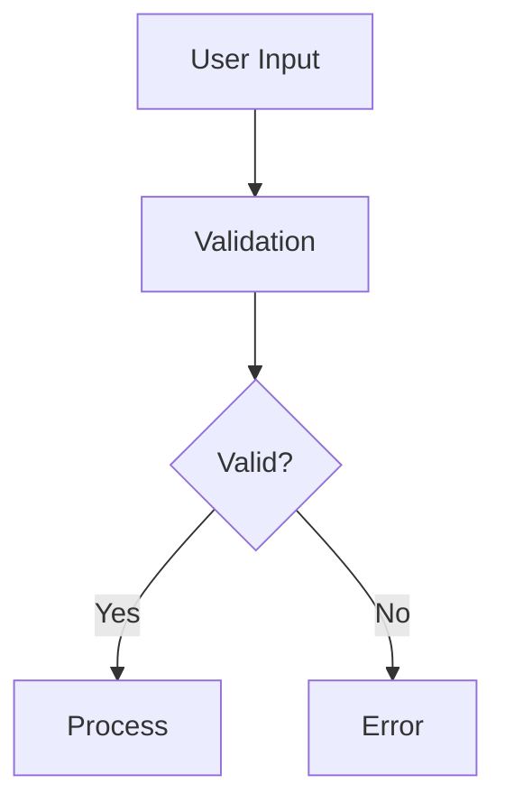
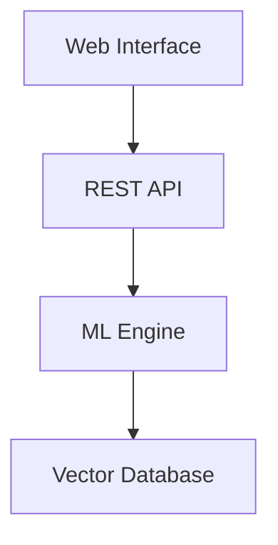

# File-Based Project Management System

This directory contains the file-based project management system for the portfolio website. Projects are defined as Markdown files with frontmatter metadata and can include rich content with embedded media, code examples, and interactive elements.

## Directory Structure

```
content/projects/
├── README.md                 # This file
├── project-name.md          # Individual project files
├── another-project.mdx      # MDX files also supported
└── assets/                  # Project-specific assets (optional)
    ├── project-name/
    │   ├── hero-image.jpg
    │   ├── demo-video.mp4
    │   └── documentation.pdf
    └── another-project/
        └── screenshot.png
```

## Project File Format

Each project file must include frontmatter with the following structure:

```markdown
---
title: "Project Title"                    # Required: Display title
subtitle: "Brief project description"     # Optional: Subtitle
date: "2024-01-01"                       # Required: Project date (YYYY-MM-DD)
status: "currently-building"             # Required: completed | currently-building | research
tags: ["React", "TypeScript", "AI"]     # Required: Array of technology tags
github: "https://github.com/user/repo"  # Optional: GitHub repository URL
live: "https://project-demo.com"         # Optional: Live demo URL
image: "./assets/hero-image.jpg"         # Optional: Hero image (relative path)
video: "./assets/demo-video.mp4"         # Optional: Demo video (relative path)
pinned: true                             # Optional: Pin to top of project list
category: "development"                  # Optional: Project category
---

# Project Content

Your project content goes here using standard Markdown syntax...
```

## Frontmatter Fields

### Required Fields
- **title**: The display title of the project
- **date**: Project creation/completion date in YYYY-MM-DD format
- **status**: One of `completed`, `currently-building`, or `research`
- **tags**: Array of technology/topic tags for filtering and categorization

### Optional Fields
- **subtitle**: Brief description shown in project cards
- **github**: GitHub repository URL
- **live**: Live demo or deployment URL
- **image**: Hero image path (relative to project file)
- **video**: Demo video path (relative to project file)
- **pinned**: Boolean to pin project to top of listings
- **category**: Project category for organization

## Asset Management

### Asset Paths
Projects can reference assets using relative paths:

```markdown
# Relative to project file


# Relative to public directory


# External URLs

```

### Asset Organization
- **Project-specific assets**: Store in `public/media/project-slug/`
- **Shared assets**: Store in `public/media/`
- **Relative references**: Use `./assets/filename.ext` in markdown

### Supported Asset Types
- **Images**: `.jpg`, `.jpeg`, `.png`, `.gif`, `.webp`, `.svg`
- **Videos**: `.mp4`, `.webm`, `.mov`, `.avi`
- **Documents**: `.pdf`
- **Other**: Any file type for download links

## Content Features

### Standard Markdown
All standard Markdown features are supported:
- Headers, paragraphs, lists
- Links and images
- Code blocks with syntax highlighting
- Tables
- Blockquotes

### Enhanced Features
- **Mermaid Diagrams**: Use \`\`\`mermaid code blocks
- **PDF Embedding**: PDF links automatically render as viewers
- **Video Players**: Video files get enhanced player controls
- **Interactive Elements**: Support for collapsible sections and tabs

### Code Examples

#### Syntax Highlighting
```typescript
interface Project {
  id: string;
  title: string;
  status: 'completed' | 'currently-building' | 'research';
}
```

#### Mermaid Diagrams


## Project Priority System

Projects are automatically prioritized based on:
1. **Pinned projects** (+100 priority)
2. **Currently building status** (+50 priority)
3. **Recent projects** (up to +30 based on recency)

## Usage Examples

### Basic Project
```markdown
---
title: "My Awesome App"
date: "2024-01-15"
status: "completed"
tags: ["React", "Node.js"]
---

# My Awesome App

A simple web application built with React and Node.js.

## Features
- User authentication
- Real-time updates
- Responsive design
```

### Advanced Project with Assets
```markdown
---
title: "AI Research Platform"
subtitle: "Advanced machine learning research tools"
date: "2024-02-01"
status: "currently-building"
tags: ["AI", "Python", "Research"]
github: "https://github.com/user/ai-platform"
image: "./assets/hero-screenshot.jpg"
video: "./assets/demo-walkthrough.mp4"
pinned: true
category: "research"
---

# AI Research Platform


An advanced platform for machine learning research...

## Architecture



## Demo

[Watch Demo Video](./assets/demo-walkthrough.mp4)

## Documentation

[Technical Specification](./assets/technical-spec.pdf)
```

## API Usage

### Loading Projects
```typescript
import { projectService } from '@/lib/projects';

// Get all projects
const projects = await projectService.getAllProjects();

// Get specific project
const project = await projectService.getProject('project-slug');

// Filter by status
const currentProjects = await projectService.getProjectsByStatus('currently-building');

// Filter by tag
const reactProjects = await projectService.getProjectsByTag('React');
```

### Asset Management
```typescript
import { assetManager } from '@/lib/asset-manager';

// Get project assets
const assets = await assetManager.getProjectAssets('project-slug');

// Resolve asset path
const resolvedPath = await assetManager.resolveAssetPath('./assets/image.jpg', 'project-slug');

// Validate asset exists
const exists = await assetManager.validateAssetExists('/media/image.jpg');
```

## Validation

Run the validation script to check your project setup:

```bash
npx tsx scripts/validate-project-system.ts
```

This will verify:
- Project directory structure
- Frontmatter validity
- MDX syntax correctness
- Asset path resolution
- Service integration

## Best Practices

1. **Consistent Naming**: Use kebab-case for project file names
2. **Asset Organization**: Keep project assets in dedicated folders
3. **Image Optimization**: Optimize images for web before adding
4. **Descriptive Tags**: Use clear, searchable tags
5. **Regular Validation**: Run validation script after changes
6. **Semantic Versioning**: Update dates when making significant changes

## Troubleshooting

### Common Issues

**Project not appearing**: Check frontmatter syntax and required fields
**Assets not loading**: Verify asset paths and file existence
**MDX errors**: Run validation script to identify syntax issues
**Performance issues**: Check for large unoptimized assets

### Debug Commands
```bash
# Test project loading
npx tsx scripts/test-projects.ts

# Full system validation
npx tsx scripts/validate-project-system.ts

# Check specific project
npx tsx -e "import { projectService } from './lib/projects.js'; projectService.getProject('project-slug').then(console.log)"
```

## Migration Guide

### From Hardcoded Projects
1. Create markdown file with project data
2. Move assets to `public/media/project-slug/`
3. Update asset references to relative paths
4. Test with validation script
5. Remove hardcoded project data

### Adding New Projects
1. Create `project-name.md` in `content/projects/`
2. Add frontmatter with required fields
3. Create asset directory if needed
4. Write project content
5. Validate with script
6. Deploy changes

This system provides a flexible, maintainable way to manage project content while supporting rich media and interactive elements.