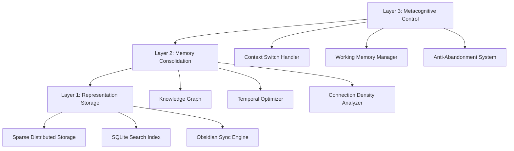

# 🧠 Brain System

An operating system for my own cognition—enforcing working-memory limits, tracking goals, and syncing knowledge graphs across local storage and Obsidian.

## Why It Exists
- Turns scattered thoughts into structured memories with attention scoring and consolidation queues.
- Anti-abandonment loop logs “wins”, blockers, and dopamine rewards so projects stay alive (152+ day streak).
- Acts as a live lab for testing cognitive science hypotheses with reproducible metrics.

## Biomimetic Architecture

## Core Systems
- **Working Memory Engine** keeps only 7±2 active items, with importance scoring and context isolation.
- **Memory Consolidation** applies exponential decay, connection density, and context boosts before archiving to the knowledge graph.
- **Goal Keeper** drives streaks with dopamine simulation, excitement tracking, and blocker mitigation.

## Ops in Practice
- CLI tools (`bstart`, `c`, `f`, `w`, `bl`) capture thoughts, find context, and log wins in under 100ms.
- Local SQLite + Obsidian sync ensures knowledge retrieval at &lt;50ms with graph visualization for cross-project insights.
- Live metrics track memory operations, search latency, and streak health so I can tune the system like production software.

## Collaboration Angle
- Designed for research partnerships exploring human-AI co-thinking, distributed cognition, and emergent behaviors.
- MIT License and documentation make it straightforward for new contributors to experiment with memory models or UI surfaces.
