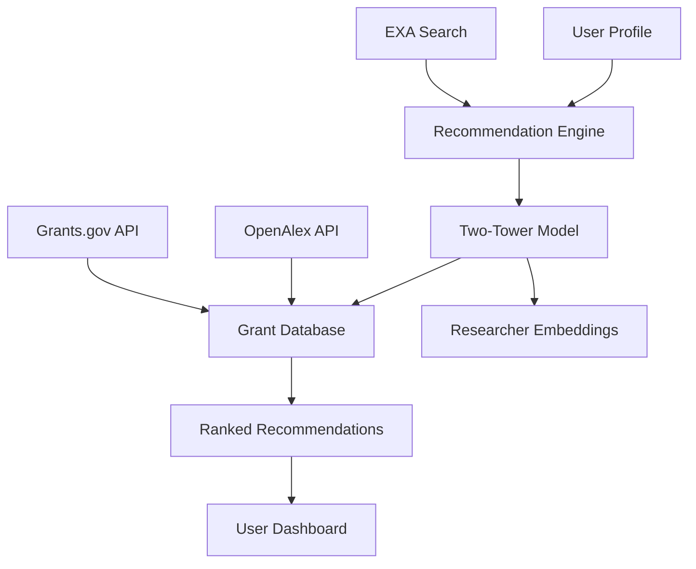

# Find&Fund: Revolutionizing Research Funding Discovery

**Live production platform** serving researchers worldwide - Find&Fund bridges the gap between researchers and funding opportunities through intelligent matching and personalized recommendations.

## 🎯 Project Overview

I am currently working to build a website which pairs the right researchers with the right funding opportunities. The platform features a sophisticated recommendation system that analyzes researcher profiles, publication history, and research interests to suggest the most relevant grants and funding sources.

## 🚀 Key Features

### Intelligent Matching System
- **Two-Tower Recommendation Architecture**: Advanced ML model that learns researcher preferences and grant characteristics
- **Multi-Modal Analysis**: Processes text, metadata, and research history for comprehensive matching
- **Real-time Updates**: Continuously updated database of funding opportunities

### Data Integration
- **OpenAlex Integration**: Access to comprehensive academic publication database
- **Grants.gov API**: Real-time federal funding opportunities
- **EXA Search**: Enhanced semantic search capabilities for research discovery

### User Experience
- **Personalized Dashboard**: Tailored recommendations based on research profile
- **Smart Filtering**: Advanced filters for funding amount, deadline, eligibility
- **Application Tracking**: Monitor application status and deadlines

## 🛠 Technical Architecture

## 💡 Innovation Highlights

### Two-Tower Recommendation System
The core of Find&Fund is a sophisticated two-tower neural network that:
- **Researcher Tower**: Encodes researcher profiles, publications, and interests
- **Grant Tower**: Processes grant descriptions, requirements, and historical data
- **Similarity Matching**: Computes compatibility scores between researchers and opportunities

### Semantic Search Enhancement
Integration with EXA provides:
- Natural language query processing
- Contextual understanding of research domains
- Cross-disciplinary opportunity discovery

## 📊 Current Progress

- ✅ **Backend Architecture**: Core recommendation system implemented
- ✅ **Data Pipeline**: OpenAlex and Grants.gov integration complete
- ✅ **MVP Frontend**: Basic user interface and dashboard
- 🔄 **ML Model Training**: Optimizing recommendation accuracy
- 🔄 **User Testing**: Gathering feedback from research community
- ⏳ **Advanced Features**: Grant application assistance tools

## 🎯 Impact Goals

### For Researchers
- **Reduce Discovery Time**: From weeks to minutes finding relevant funding
- **Increase Success Rate**: Better matching leads to higher application success
- **Expand Opportunities**: Discover cross-disciplinary funding sources

### For Funding Organizations
- **Better Applications**: Researchers find more relevant opportunities
- **Increased Diversity**: Reach underrepresented research communities
- **Data Insights**: Understanding of funding landscape trends

## 🔬 Research Applications

The platform serves diverse research domains:
- **STEM Research**: NSF, NIH, DOE funding opportunities
- **Social Sciences**: NEH, NEA, foundation grants
- **Interdisciplinary**: Cross-cutting initiatives and collaborative funding
- **Early Career**: Specialized opportunities for emerging researchers

## 📈 Future Roadmap

### Phase 1: Enhanced Recommendations (Q1 2025)
- Advanced ML model deployment
- Collaborative filtering integration
- Real-time preference learning

### Phase 2: Application Assistance (Q2 2025)
- AI-powered proposal writing assistance
- Budget planning tools
- Compliance checking automation

### Phase 3: Community Features (Q3 2025)
- Researcher collaboration matching
- Grant application peer review
- Success story sharing platform

## 🤝 Collaboration Opportunities

Find&Fund is actively seeking:
- **Research Institution Partnerships**: Beta testing and feedback
- **Funding Organization Collaboration**: Direct API integrations
- **Academic Advisors**: Domain expertise and validation
- **Investment Partners**: Scaling and sustainability planning

## 📞 Get Involved

Interested in the future of research funding discovery? 

- **Try the Beta**: [findandfund.vercel.app](https://findandfund.vercel.app/)
- **Contribute**: Check out the [GitHub repository](https://github.com/Tar-ive/find-fund)
- **Connect**: Reach out for collaboration opportunities

---

*Find&Fund represents the intersection of AI, research, and social impact - making the funding discovery process more equitable and efficient for researchers worldwide.*