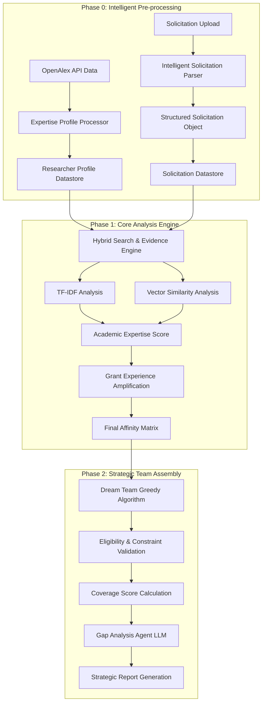

# 🔬 AI-Powered NSF Grant Matching Engine

End-to-end system that parses NSF calls, scores researcher fit, and assembles “dream teams” in minutes instead of weeks.

## Key Outcomes
- 78% reduction in team assembly time; 23% uplift in skill coverage vs. manual picks.
- 100% accuracy on eligibility checks by combining rule parsing + semantic filters.
- Production Streamlit front-end so research offices can search solicitations and export briefs instantly.

## System Architecture

## What Runs Under the Hood
- TF‑IDF + dense embeddings blend to score expertise, with logarithmic boosts for past NSF wins.
- Constraint engine checks PI eligibility, institutional caps, and collaboration history before finalizing rosters.
- LLM-powered gap analysis crafts stakeholder-ready reports highlighting risks, mitigations, and go/no-go.

## Delivery & Ops
- Python + Streamlit app deployable on campus infrastructure; uses uv/poetry for reproducible environments.
- Pydantic data contracts and pytest suite guard parsing edge cases across PDF formats.
- Tutorials walk grant offices through one-click ingest, team review, and export workflows.
