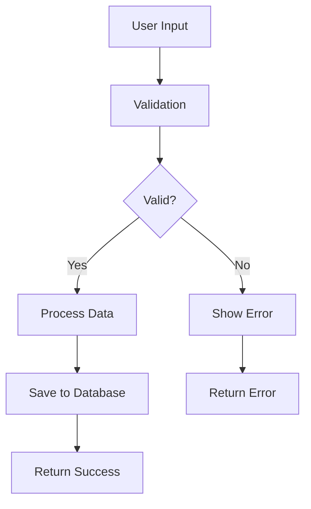

# Test Project

This is a test project to verify our MDX rendering system is working correctly.

## Features

- **MDX Rendering**: Universal content rendering with next-mdx-remote/rsc
- **Syntax Highlighting**: Code blocks with proper theming
- **TypeScript Integration**: Full type safety with Zod validation
- **shadcn/ui Components**: Consistent UI components throughout

## Code Example

Here's a simple TypeScript function:

```typescript
interface User {
  id: string;
  name: string;
  email: string;
}

function createUser(userData: Omit<User, 'id'>): User {
  return {
    id: crypto.randomUUID(),
    ...userData,
  };
}

const newUser = createUser({
  name: "John Doe",
  email: "john@example.com"
});
```

## Mermaid Diagram



## Interactive Elements

This section tests basic markdown rendering without JSX components for now.

## Links and Media

- [External Link](https://example.com)
- [PDF Document](/SWE_python.pdf)
- [Internal Link](/projects)


## PDF Viewer Test

The PDF link below should automatically render as an inline PDF viewer:

[Test PDF Document](/SWE_python.pdf)

## Conclusion

This test project demonstrates the MDX rendering capabilities with syntax highlighting, interactive components, and proper styling.