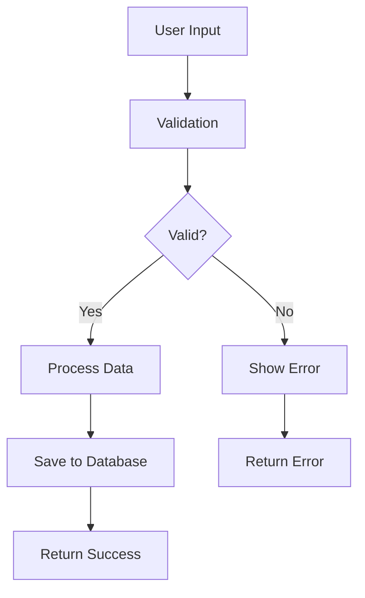
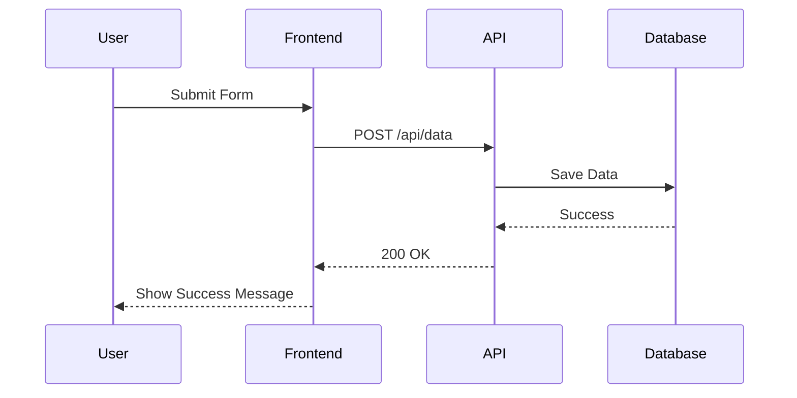
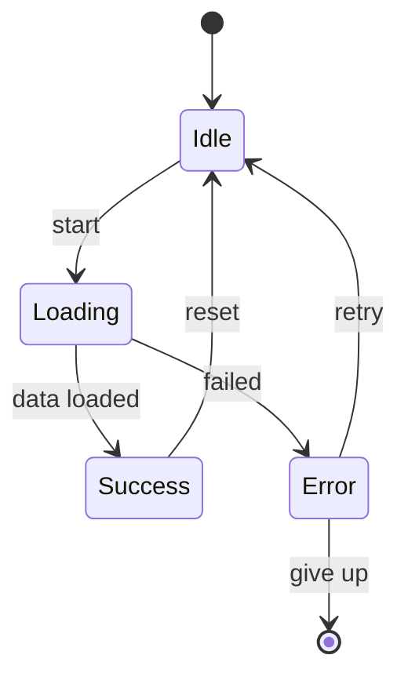
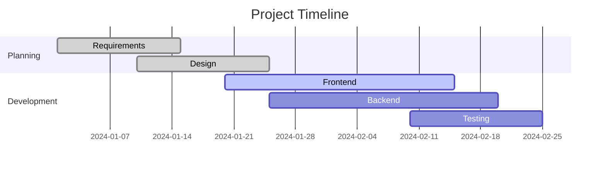
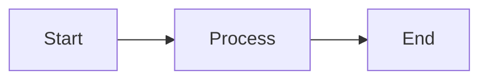

# Mermaid Diagram Test

This page demonstrates Mermaid diagram rendering in Nextra.

## Basic Flowchart



## Sequence Diagram



## Class Diagram

```mermaid
classDiagram
    class User {
        +String id
        +String name
        +String email
        +createUser()
        +updateUser()
        +deleteUser()
    }
    
    class Project {
        +String id
        +String title
        +String description
        +Date createdAt
        +User owner
        +createProject()
        +updateProject()
    }
    
    User ||--o{ Project : owns
```

## State Diagram



## Gantt Chart



## Interactive Features

Nextra's Mermaid integration provides:

- **Responsive Design**: Diagrams scale with the viewport
- **Theme Support**: Automatic light/dark mode switching
- **Copy Support**: Click to copy diagram source
- **Zoom**: Interactive zoom for complex diagrams

## Code Example

Here's how to add a Mermaid diagram in your MDX:

````markdown

````

The diagram will be automatically rendered by Nextra's built-in Mermaid support.