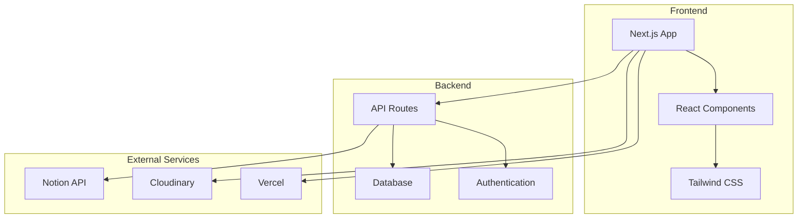
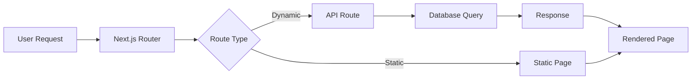
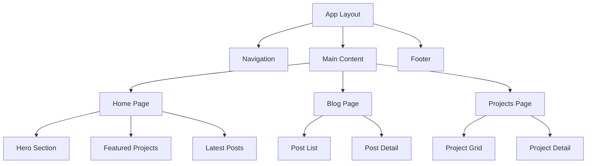

# Projects

This section contains detailed documentation for various projects.

## Project Architecture

Here's a high-level overview of the project architecture:



## Development Workflow

```mermaid
gitgraph
    commit id: "Initial setup"
    branch feature
    checkout feature
    commit id: "Add component"
    commit id: "Add tests"
    checkout main
    merge feature
    commit id: "Deploy"
```

## Data Flow



## Component Hierarchy

